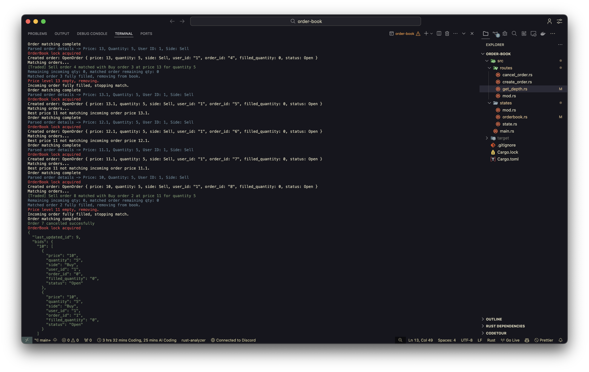

# Rust Order Book

A simple in-memory order book implementation in Rust with basic matching capabilities.  
Currently supports:
- Creating buy/sell orders
- Canceling existing orders
- Querying order book depth
- Automatically matching orders when prices cross

---

## Features
- **Create Order**: Add a new buy (bid) or sell (ask) order to the book.
- **Cancel Order**: Remove an order by ID if it exists and has not been fully matched.
- **Get Depth**: View the current state of the order book (bids, asks, and metadata).
- **Basic Matching**: New orders are automatically matched against the opposite side if prices are favorable.

---

## How It Works
Orders are stored in two hash maps:
- **Bids** (`price -> list of orders`) — Buyers willing to purchase at or above a price.
- **Asks** (`price -> list of orders`) — Sellers willing to sell at or below a price.

When a new order is created:
1. If it can match with the best available price on the opposite side:
   - A trade is executed.
   - Quantities are updated or orders are removed if filled.
2. If not matched, the order is added to the appropriate side of the book.

---

## API Overview

### 1. Create Order
```rust
order_book.create_order(price, quantity, side, order_id);
```

### 2. Cancel Order
```rust
cancel_order(price, order_id, side)
```

### 3. Get Depth
```rust
get_depth()
```

## Output
- The output after the bunch of requests in the cli is:
